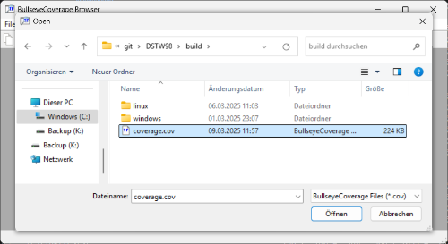
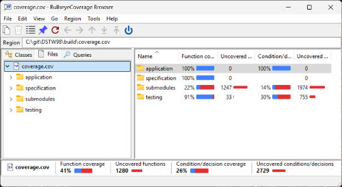
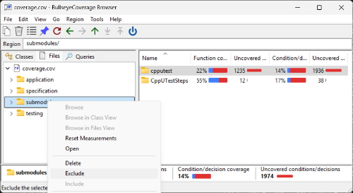
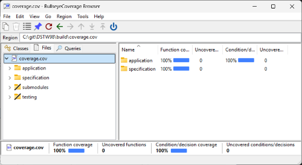
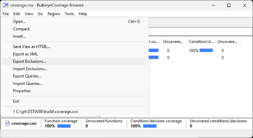
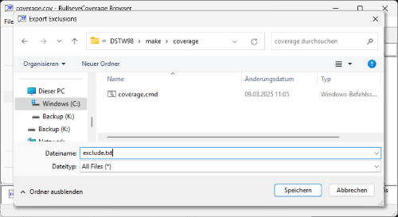

# how to setup a script to run module tests with Bullseye coverage
Windows CMD sample

## preconditions
-   install MS build tools or Visual Studio
-   and then install Bullseye coverage

## sample project _DSTW_
```
repo
|-- specification
|-- application
|   |-- components
|   `-- main
|       `-- AppMain.cpp
|
|-- testing
|   |-- testenv
|   |-- tests
|   |   |-- moduletests
|   |   |-- moduletestsIL
|   |   `-- systemtests
|   `-- testmain
|       `-- testMain.cpp
|
|-- make
|   |-- coverage
|   |   `-- coverage.cmd (our script)
|
|-- submodules
|   |-- CppUTestSteps
|   `-- cpputest
|
| temporary:
|-- build
|-- reports
```
## requirements
### general
-   return code of script (e.g. for Jenkins pipeline success)
    - 0 (OK) if desired coverage reached
    - 1 (NOK) otherwise
### for this sample
-   code coverage required for
```
|-- specification
|-- application
|   `-- components
```
-   Two different test runs required for full coverage

## sample ms build solution _DSTW.sln_
- testenv.vcxproj - static lib
```
|-- testing
|   `-- testenv
|
|-- submodules
|   |-- CppUTestSteps
|   `-- cpputest
```
- moduletests.vcxproj - console app using testenv.lib
```
|-- specification
|-- application
|   `-- components
|
|-- testing
|   |-- tests
|   |   `-- moduletests
|   `-- testmain
|       `-- testMain.cpp
```
- moduletestsIL.vcxproj - console app using testenv.lib
```
|-- specification
|-- application
|   `-- components
|
|-- testing
|   |-- tests
|   |   `-- moduletestsIL
|   `-- testmain
|       `-- testMain.cpp
```
## setting up the script

### setup
- determine relevant directories
```cmd
@echo off
SETLOCAL
cd /d %~dp0
set myDir=%cd%
cd ..
set makeDir=%cd%
cd ..
set repoDir=%cd%
set buildDir=%cd%\build
set reportsDir=%cd%\reports
set exeDir=%buildDir%\windows\bullseye
```
- solution and reporting files

```cmd
set vsSolution=%makeDir%\DSTW.sln
set report=%reportsDir%\coverage.txt
set todoTxt=%reportsDir%\todo.txt
```
-   Bullseye coverage file: %COVFILE% 
    -   can have any name
    -   extension _.cov_ makes sense - since assigned to coverage browser
```cmd
set covfile=%buildDir%\coverage.cov
```
- exclude file (which we don't have yet) 
```cmd
set excludeFile=%myDir%\exclude.txt
```

- Bullseye coverage behavior %COVCOPT%
    - top level directory for coverage output
    - macro instrumentation on
```cmd
set covcopt=--srcdir %repoDir% --macro
```
- desired coverage
function,decision in %
```cmd
set covMin=100,100
```
- exit status
```cmd
set elevel=0
```
- msbuild call
    - could be called with any configuration
    - separating instrumented and non instrumented builds saves a lot of clean builds
```cmd
set vsCall=msbuild -m %vsSolution% -p:configuration=bullseye
```
-   provide temporary folders
-   remove old reports
```cmd
md %buildDir% %reportsDir% >NUL 2>&1
DEL /Q %report% %todoTxt% >NUL 2>&1
```
- save current Bullseye instrumentation state (to restore at script end)
```cmd
cov01 -q --push
```
### clean
reasons:
- coverage file does not exist
- command line option -c
```cmd
set clean=0
if not exist %covfile% set clean=1
if "%1" == "-c" set clean=1

if %clean% == 1 (
    DEL /Q %covfile% >NUL 2>&1
    %vsCall% -t:Clean
)
```
### build
-   activate coverage instrumentation
-   call ms build
```cmd
cov01 -q --on
%vsCall% -t:"moduletests,moduletestsIL"
if %errorlevel% NEQ 0 goto err
```
- check if coverage file has been built
(not really necessary)
```cmd
if not exist %covfile% (
    echo %covfile% not found
    goto err
)
```
### run
- rewind coverage file (it might not be new)
```cmd
covclear -q
```
- run moduletests executables
```cmd
for %%t in (moduletests moduletestsIL) do (
    %exeDir%\%%t.exe
    if %errorlevel% NEQ 0 goto err
)
```
### report
-   apply exclude file (which we don't have at 1st run)
```cmd
covselect -qd --import %excludeFile%
```
-   change directory to coverage file location 
```cmd
cd %buildDir%
```
-   write report
    -   directory coverage _covdir_ in this sample
    -   you might as well use:
        - _covsrc_ for source wise output
        - _covclass_ for class wise output
```cmd
covdir -q --by-name > %report%
type %report%
```
-   apply coverage minima reached check and save return for script exit
```cmd
covdir -q --checkmin %covMin%
set elevel=%errorlevel%
```
-   if not passed: write todo report using _covbr_ 
```cmd
if %elevel% NEQ 0 covbr -qu > %todoTxt%
```
-   restore previous instrumentation state
-   exit with coverage passed value
```cmd
:end
cov01 -q --pop
exit /b %elevel%
```
-   error jump mark
```cmd
:err
set elevel=1
goto end
```
## 1st run
run script
- script will show error: missing exclude file
- report contains everything 
```shell
- report
Exception: cannot open 'c:\git\DSTW98\make\coverage\exclude.txt': No such file or directory
Directory                                               Function Coverage        C/D Coverage
-----------------------------------------------------  ------------------  ------------------
application/components/                                 184 /  184 = 100%   317 /  317 = 100%
...
specification/                                           10 /   10 = 100%     0 /    0
...
submodules/                                             369 / 1616 =  22%   346 / 2320 =  14%
...
testing/                                                334 /  367 =  91%   338 / 1093 =  30%
-----------------------------------------------------  ------------------  ------------------
Total                                                   897 / 2177 =  41%  1001 / 3730 =  26%
```

## setup exclude file with coverage browser
### open coverage file in coverage browser




### exclude regions of no interest from coverage
- (right click, context menu)




### export to exclude file
- File, Export Exclusions...





## 2nd run
run script
- script should not show an error
- report contains desired regions

```shell
Directory                        Function Coverage      C/D Coverage
-------------------------------  -----------------  ----------------
application/components/           184 / 184 = 100%  317 / 317 = 100%
application/components/BAS/        43 /  43 = 100%   32 /  32 = 100%
application/components/BAS/src/     7 /   7 = 100%    0 /   0
application/components/COM/        51 /  51 = 100%   70 /  70 = 100%
application/components/COM/src/    40 /  40 = 100%   70 /  70 = 100%
application/components/LCR/        12 /  12 = 100%   37 /  37 = 100%
application/components/LCR/src/     7 /   7 = 100%   37 /  37 = 100%
application/components/SIG/        26 /  26 = 100%   91 /  91 = 100%
application/components/SIG/src/    19 /  19 = 100%   91 /  91 = 100%
application/components/SYS/        44 /  44 = 100%   65 /  65 = 100%
application/components/SYS/src/    16 /  16 = 100%   59 /  59 = 100%
application/components/TSW/         8 /   8 = 100%   22 /  22 = 100%
application/components/TSW/src/     6 /   6 = 100%   22 /  22 = 100%
specification/                     10 /  10 = 100%    0 /   0
specification/codebase/             2 /   2 = 100%    0 /   0
specification/ifs/                  8 /   8 = 100%    0 /   0
-------------------------------  -----------------  ----------------
Total                             194 / 194 = 100%  317 / 317 = 100%
```
### appendix: the files
-   the script
```cmd
@echo off
SETLOCAL
cd /d %~dp0
set myDir=%cd%
cd ..
set makeDir=%cd%
cd ..
set repoDir=%cd%
set buildDir=%cd%\build
set reportsDir=%cd%\reports
set exeDir=%buildDir%\windows\bullseye

set vsSolution=%makeDir%\DSTW.sln
set report=%reportsDir%\coverage.txt
set todoTxt=%reportsDir%\todo.txt
set covfile=%buildDir%\coverage.cov

set covcopt=--srcdir %repoDir% --macro
set excludeFile=%myDir%\exclude.txt
set covMin=100,100

set vsCall=msbuild -m %vsSolution% -p:configuration=bullseye

set elevel=0

md %buildDir% %reportsDir% >NUL 2>&1

cov01 -q --push

set clean=0
if not exist %covfile% set clean=1
if "%1" == "-c" set clean=1
if %clean% == 1 (
    echo - clean
    %vsCall% -t:Clean
    DEL /Q %covfile% >NUL 2>&1
)

echo -build
cov01 -q --on
%vsCall% -t:"moduletests,moduletestsIL"
if %errorlevel% NEQ 0 goto err

if not exist %covfile% (
    echo %covfile% not found
    goto err
)

echo - run
covclear -q
for %%t in (moduletests moduletestsIL) do (
    %exeDir%\%%t.exe
    if %errorlevel% NEQ 0 goto err
)

echo - report
covselect -qd --import %excludeFile%

cd %buildDir%
covdir -q --by-name > %report%
type %report%

covdir -q --checkmin %covMin%
set elevel=%errorlevel%
if %elevel% NEQ 0 covbr -qu -f %covfile% > %todoTxt%

:end
cov01 -q --pop
exit /b %elevel%

:err
set elevel=1
goto end

```
-   the exclude file
```
exclude all /
include folder application/
include folder specification/
```
