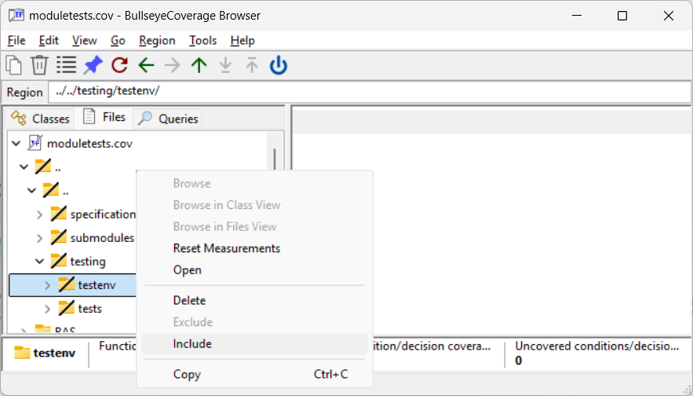
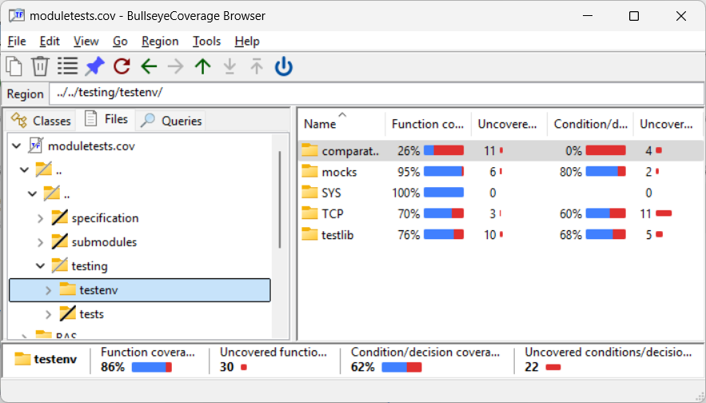

# how to setup a script to run module tests with Bullseye coverage
Windows CMD sample
## preconditions
-   install MS build tools or Visual Studio
-   and then install Bullseye coverage
-   script must run in _Developer Command Prompt_ shell

## sample project _DSTW98_
```
repo
|-- application
|   |-- components
|   |   |-- BAS
|   |   |-- CFG
|   |   |-- COM
|   |   |-- LCR
|   |   |-- SIG
|   |   |-- SYS
|   |   `-- TSW
|   `-- main
|
|-- scripts
|   |-- coverage
|   |   |-- exclude.txt
|   |   `-- moduletests.cmd (our script)
|   ...
|
|-- submodules
|   |-- CppUTestSteps
|   |-- cpputest
|   ...
|
|-- testing
|   |-- testenv
|   |-- tests
|       |-- moduletests
|       |-- systemtests
|       ...
|
|-- vs
|   |-- DSTW.sln
|   |-- submodules.vcxproj
|   |-- moduletests.vcxproj
|   |-- systemtests.vcxproj
|   ...
|
| temporary:
|-- build
|-- reports
```
## requirements
### general
#### development
-   Script must enable incremental test development without permanent clean builds.
    -   implement
    -   run script
    -   view results in coverage browser
-   instrumentation state should not be changed after script run
#### pipelines e.g. Jenkins
-   Return code of script must mirror if desired coverage reached.
    - 0 desired coverage reached
    - 1 otherwise
-  A minimal text based reporting to be saved as artifact might be provided:
    - coverage overview
    - todo report
### for this sample

-   code coverage required for
```
|-- application
|   |-- components
```

application/components shall be the top level of reports output
## sample ms build solution _DSTW.sln_
- submodules.vcxproj - static lib (for module tests and system tests)
```
|-- submodules
|   |-- CppUTestSteps
|   `-- cpputest
```
- moduletests.vcxproj - console app using submodules.lib
```
|-- application
|   |-- components
|
|-- testing
|   |-- testenv
|   |-- tests
|       `-- moduletests
```
## setting up the script step by step

### setup
- determine relevant directories
```cmd
@echo off
SETLOCAL
cd /d %~dp0
set myDir=%cd%
cd ../..
set repoDir=%cd%
set buildDir=%repoDir%\build
set compDir=%repoDir%\application\components
set reportsDir=%repoDir%\reports
set vsDir=%repoDir%\vs
set exeDir=%buildDir%\windows\release
```

- solution and reporting files
```cmd
set vsSolution=%vsDir%\DSTW.sln
set report=%reportsDir%\moduletests_coverage.txt
set todoTxt=%reportsDir%\moduletests_todo.txt
```
-   Bullseye coverage file: %COVFILE%
    -   can have any name
    -   extension _.cov_ makes sense - since assigned to coverage browser
```cmd
set COVFILE=%buildDir%\moduletests.cov
```
- exclude file (which we don't have yet)
```cmd
set excludeFile=%myDir%\exclude.txt
```

- Bullseye coverage behavior %COVCOPT%
    - top level directory for coverage output
    - macro instrumentation activated
```cmd
set COVCOPT=--srcdir %compDir% --macro
```
- desired coverage
(function,decision in %)
```cmd
set covMinima=100,98
```
- exit status
```cmd
set elevel=0
```
- msbuild call (build can be called with any configuration)
```cmd
set buildCall=msbuild -m %vsSolution% -p:configuration=release
```
-   provide temporary folders
-   remove old reports
```cmd
md %buildDir% %reportsDir% >NUL 2>&1
DEL /Q %report% %todoTxt% >NUL 2>&1
```
- save current Bullseye instrumentation state (to restore at script end)
```cmd
cov01 -q --push
```
### clean
reasons:
- coverage file does not exist
- command line option -c
```cmd
set clean=0
if not exist %covfile% set clean=1
if "%1" == "-c" set clean=1

if %clean% == 1 (
    DEL /Q %covfile% >NUL 2>&1
    %buildCall% -t:Clean
)
```
### build
#### without coverage
(see [remarks](##remarks))
-   deactivate coverage instrumentation
-   call ms build
 ```cmd
cov01 -q --off
%buildCall% -t:submodules
if %errorlevel% NEQ 0 goto err
```
#### coverage instrumented
-   activate coverage instrumentation
-   call ms build
```cmd
cov01 -q --on
%buildCall% -t:moduletests
if %errorlevel% NEQ 0 goto err
```
- check if coverage file has been built (not really necessary)
```cmd
if not exist %covfile% (
    echo %covfile% not found
    goto err
)
```
### run
- rewind coverage file (it might not be new)
```cmd
covclear -q
```
- run module test executable
```cmd
%exeDir%\moduletests.exe
if %errorlevel% NEQ 0 goto err
```
### report
-   apply exclude file (which we don't have at 1st run)
```cmd
covselect -qd --import %excludeFile%
```
-   change directory to coverage file location (see [remarks](##remarks))
```cmd
cd %buildDir%
```
-   write report
    -   in this sample: _covdir_ for directory wise coverage output
    -   you might as well use:
        - _covsrc_ for source wise output
        - _covclass_ for class wise output
```cmd
covdir -q --by-name > %report%
type %report%
```
-   apply coverage minima reached check and save return for script exit
```cmd
covdir -q --checkmin %covMinima%
set elevel=%errorlevel%
```
-   if not 100% coverage - write todo report using _covbr_ (see [appendix](##appendix))
```cmd
covdir -q --checkmin 100,100
if %errorlevel% NEQ 0 covbr -qu > %todoTxt%
```
-   restore previous instrumentation state
-   exit with coverage passed value
```cmd
:end
cov01 -q --pop
exit /b %elevel%
```
-   error jump mark
```cmd
:err
set elevel=1
goto end
```
## 1st run
run script
- script will show error: missing exclude file
- report contains everything
- coverage minima not reached

```shell
Exception: cannot open 'c:\git\DSTW98\scripts\coverage\exclude.txt': No such file or directory
Directory                                 Function Coverage        C/D Coverage
----------------------------------------  -----------------  ------------------
../../                                     345 / 519 =  66%   312 / 1001 =  31%
../../specification/ifs/                     6 /   6 = 100%     0 /    0
../../submodules/                            7 / 149 =   4%     0 /    6 =   0%
../../testing/                             332 / 364 =  91%   312 /  995 =  31%
../../testing/testenv/                     197 / 227 =  86%    36 /   58 =  60%
../../testing/tests/moduletests/           135 / 137 =  98%   276 /  937 =  29%
BAS/                                        43 /  43 = 100%    32 /   32 = 100%
BAS/src/                                     7 /   7 = 100%     0 /    0
COM/                                        51 /  51 = 100%    70 /   70 = 100%
COM/src/                                    40 /  40 = 100%    70 /   70 = 100%
LCR/                                        12 /  12 = 100%    37 /   37 = 100%
LCR/src/                                     7 /   7 = 100%    37 /   37 = 100%
SIG/                                        26 /  26 = 100%    91 /   91 = 100%
SIG/src/                                    19 /  19 = 100%    91 /   91 = 100%
SYS/                                        32 /  32 = 100%    65 /   65 = 100%
SYS/src/                                    16 /  16 = 100%    59 /   59 = 100%
TSW/                                         8 /   8 = 100%    22 /   22 = 100%
TSW/src/                                     6 /   6 = 100%    22 /   22 = 100%
----------------------------------------  -----------------  ------------------
Total                                      517 / 691 =  74%   629 / 1318 =  47%

C:\git\DSTW98>echo %errorlevel%
1
```

## setup exclude file with coverage browser
### open coverage file in coverage browser


### exclude regions of no interest from coverage
- (right click, context menu, Exclude)


### export to exclude file
- File, Export Exclusions...


## 2nd run
run script
- script should not show an error
- report contains desired regions only
- coverage minima reached

```shell
Directory  Function Coverage      C/D Coverage
---------  -----------------  ----------------
BAS/         43 /  43 = 100%   32 /  32 = 100%
BAS/src/      7 /   7 = 100%    0 /   0
COM/         51 /  51 = 100%   70 /  70 = 100%
COM/src/     40 /  40 = 100%   70 /  70 = 100%
LCR/         12 /  12 = 100%   37 /  37 = 100%
LCR/src/      7 /   7 = 100%   37 /  37 = 100%
SIG/         26 /  26 = 100%   91 /  91 = 100%
SIG/src/     19 /  19 = 100%   91 /  91 = 100%
SYS/         32 /  32 = 100%   65 /  65 = 100%
SYS/src/     16 /  16 = 100%   59 /  59 = 100%
TSW/          8 /   8 = 100%   22 /  22 = 100%
TSW/src/      6 /   6 = 100%   22 /  22 = 100%
---------  -----------------  ----------------
Total       172 / 172 = 100%  317 / 317 = 100%

C:\git\DSTW98>echo %errorlevel%
0
```

### the files
Find script and exclude file at the [DSTW98 repo](https://github.com/sorgom/DSTW98/tree/SOM_DEVEL/scripts/coverage).


## remarks
### decent relative paths output
Bullseye output is a bit tricky to handle.

To achieve decent paths output with covdir or covsrc there are two options.
1) change dir to coverage file location (as in our script)
```cmd
cd %buildDir%
covdir -q --by-name > %report%
```
2) or change dir to application root (as set with %COVCOPT%) and use _--srcdir ._
```cmd
cd %compDir%
covdir -q --by-name --srcdir . > %report%
```
### exclude regions from instrumentation during build

There is no actual need to exclude parts from instrumented build.

- What you can safely exclude:
    - third party sources (like CppUTest) that you have linked as git submodules

- What you should not exclude:
    - your own test environment - you might finally want to check what was really used





### HTML reports from CI pipelines

There is no reason to generate and save HTML reports cause no one reads them.

Required information:
- coverage passed / failed
- a basic overview (covdir / covsrc)
- missing coverage (covbr)

For test development you only need the coverage browser.
## appendix 
### sample _covbr_ output with missing coverage

```
...
c:/git/DSTW98/application/components/SYS/Provider.h:
c:/git/DSTW98/application/components/SYS/Reader.h:
  ...
       11 {
       12 public:
       13     void read();
-->    14     inline const ComSetup& getComSetup() const { return mComSetup; }
       15
       16     INSTANCE_DEC(Reader)
       17     NOCOPY(Reader)
       18 private:
       19     ComSetup mComSetup;
-->    20     inline Reader() {}
       21 };
       22 #endif // _H
c:/git/DSTW98/application/components/SYS/src/Ctrl.cpp:
  ...
        4 #include <algorithm>
        5 #include <iostream>
        6
-->     7 INSTANCE_DEF(Ctrl)
        8
-->     9 void Ctrl::log(E_Comp, E_Err ret)
       10 {
       11     mErr = maxv(mErr, ret);
       12 }
c:/git/DSTW98/application/components/SYS/src/Main.cpp:
c:/git/DSTW98/application/components/SYS/src/Mapper.cpp:
...
```
